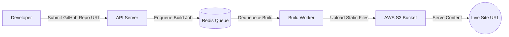

# InstaOps

InstaOps is a frontend deployment platform that allows developers to deploy React applications directly from a GitHub repository. By providing a repository URL, InstaOps clones the project, builds it using Node.js, and uploads the production-ready static files to an AWS S3 bucket. The result is a live public URL serving the React app. InstaOps uses a queue (Redis) and background workers to perform builds asynchronously, making the deployment process fast and reliable.

## Features

- **GitHub Integration**: Trigger deployments by specifying a GitHub repo URL.  
- **Automated Build**: Clones the repo and runs the build process (`npm install`, `npm run build`).  
- **AWS S3 Hosting**: Uploads the built static files to an S3 bucket for scalable static hosting.  
- **Queue-based Workflow**: Uses Redis to queue build jobs and manage build workers.  
- **Live URLs**: Generates a unique live URL (or domain) for each deployment.  
- **React Dashboard**: Includes a React-based UI to initiate deployments and view status (if provided).  
- **Vercel/Netlify-style Deployment**: Combines CI/CD-like automation without complex configuration.

## Tech Stack

- **Frontend (Client)**: React.js (likely with Tailwind CSS or similar) for the deployment dashboard UI.  
- **Backend (API Server)**: Node.js with Express (or similar) providing REST endpoints for submissions and status.  
- **Build Worker**: Node.js worker that processes build jobs from a Redis queue.  
- **Queue**: Redis for job queueing and pub/sub messaging.  
- **AWS Infrastructure**: Amazon S3 for static file hosting.  
- **Other**: AWS SDK for Node.js (to upload to S3), possibly the AWS CLI or SDK for credentials.  
- **Containerisation**: *UNSPECIFIED in repo* (no Dockerfile or container instructions found).  
- **Dev Tools**: npm (or yarn), Git.

## Architecture

The following diagram shows the high-level architecture and flow of a deployment:



1. **User** provides a GitHub repository URL via the web UI or API.  
2. **API Server** clones the repository and pushes a build job onto the Redis queue.  
3. **Redis Queue** holds the job until the build worker is ready.  
4. **Build Worker** pulls the job, runs `npm install` and `npm run build`, then uploads the `build` or `dist` folder to the configured S3 bucket.  
5. **AWS S3** stores the static files (HTML, CSS, JS, assets) for the project.  
6. **Live URL**: Once uploaded, a live URL (often via a configured CloudFront or direct S3 site endpoint) is provided to the user to access the deployed app.

## Project Structure

The repository is organised into multiple services/components, for example:

```
InstaOps/
├── frontend/         # React.js client app (deployment dashboard)
├── api-server/       # Express.js backend (clones repos, enqueues jobs)
├── build-server/     # Build worker (builds code, uploads to S3)
├── redis-queue/      # Redis queue client code (job definitions)
├── utils/            # Shared utilities or library code
└── deployment/       # Scripts or configs for deployment (e.g. CloudFormation)
```

*Note: This structure is inferred; exact folder names/files should be confirmed from the repo.* Files like `.gitignore` and `.env.example` may be in the root or relevant subfolders.

## Setup & Installation

1. **Clone the Repo**  
   ```bash
   git clone https://github.com/itsmeSanyam09/InstaOps.git
   cd InstaOps
   ```

2. **Install Dependencies**  
   Each component likely has its own `package.json`. For example:  
   ```bash
   # In project root (if monorepo):
   npm install

   # If separate:
   cd frontend && npm install
   cd ../api-server && npm install
   cd ../build-server && npm install
   ```
3. **Start Services**  
   Ensure Redis is running. Then start the services:

   - **API Server** (in `api-server/` directory):  
     ```bash
     npm run start
     ```  
     (or `npm run dev` if using nodemon)

   - **Build Worker** (in `build-server/` directory):  
     ```bash
     npm run start
     ```  
     (Worker listens to Redis and processes jobs.)

   - **Frontend Dashboard** (in `frontend/` directory):  
     ```bash
     npm run start
     ```  
     This typically starts a development server (e.g. on port 3000). You can open the dashboard in your browser to submit deployments.

4. **Set AWS Credentials**  
   Make sure AWS credentials (from step 3) are loaded into the environment. You can also configure them via the AWS CLI or SDK config if preferred. The code uploads to S3 using these credentials.

5. **Docker (if applicable)**  
   *UNSPECIFIED in repo* – If the repository includes Dockerfiles or a `docker-compose.yml`, use those to build and run containers. Otherwise, run the services locally as above.

## Deployment Flow

1. **Submit Repository:** User inputs a GitHub repo URL (e.g. `https://github.com/user/my-react-app`) via the frontend UI or an API endpoint (e.g. `POST /deploy`).  
2. **Clone & Validate:** The API server clones the repository into a temporary workspace, validates it’s a React app, and ensures required scripts (like `npm run build`) exist.  
3. **Queue the Job:** The API pushes a new job onto Redis (e.g. with `{ repo: "...", id: "<deploy-id>" }`).  
4. **Build Worker:** The worker process pops the job from Redis, runs `npm install` and `npm run build` in the cloned repo.  
5. **Upload to S3:** After a successful build, the worker uploads the output directory (often `build/` or `dist/`) to the configured S3 bucket, under a path named by the deployment ID.  
6. **Generate URL:** The system constructs a live URL pointing to the deployed site (for example, `https://<bucket>.s3.<region>.amazonaws.com/<deploy-id>/`). This URL is returned to the user.  
7. **Serve Content:** The React app is now accessible at the live URL. Any update requires a new deployment (new repo URL submission).

## Usage Examples

- **Frontend UI:** Navigate to the dashboard (e.g. `http://localhost:3000`). Enter the GitHub repository URL of your React project and click “Deploy”. After a moment, you will receive a live URL.  
- **API Endpoint (example):**  
  ```bash
  curl -X POST http://localhost:5000/deploy \
    -H "Content-Type: application/json" \
    -d '{"repoUrl": "https://github.com/username/my-react-app"}'
  ```  
  The server responds with a deployment ID and a URL (or it may poll for status).

- **Checking Status:** If the project provides status endpoints (e.g. `GET /status/<deploy-id>`), you can poll to see build logs or success/failure state. (Details *UNSPECIFIED in repo*.)

## NPM Scripts

The repository likely defines useful npm scripts. Example scripts (actual names may vary):

| **Location**      | **Script**     | **Effect**                             |
|-------------------|----------------|----------------------------------------|
| `frontend/package.json`  | `start` / `dev`   | Runs the React development server.    |
| `frontend/package.json`  | `build`      | Builds the React app for production.   |
| `api-server/package.json`| `start`      | Launches the API server (Express).     |
| `api-server/package.json`| `dev` (if any) | Starts API with auto-reloading (nodemon). |
| `build-server/package.json` | `start`      | Runs the build worker process.         |

*Check each `package.json` for exact script names and usage. The above are typical conventions.*

## AWS S3 & Redis Configuration

- **AWS S3 Bucket:** Create an S3 bucket and note its name. Configure permissions so that your AWS user (via `AWS_ACCESS_KEY_ID`/`SECRET_ACCESS_KEY`) can upload (`PutObject`) and list objects.  
- **CORS (Optional):** If the React app or API needs to call S3 directly, set the bucket’s CORS policy accordingly. Otherwise, uploads are done server-side by the build worker.  
- **Redis:** Ensure a Redis instance is running and reachable at the `REDIS_HOST` and `REDIS_PORT` you configured. No special Redis setup is needed beyond default instance availability.

## Docker (if present)

If the repository includes Docker configuration, you could build and run the services using Docker. For example:
```bash
docker build -t instaops-api ./api-server
docker build -t instaops-worker ./build-server
docker build -t instaops-frontend ./frontend
```
Then run containers linking them and exposing ports. *UNSPECIFIED in repo:* (If no Dockerfile is present, this step is omitted.)

## Project Structure Summary

For quick reference, a more detailed view of the folder structure (with example sub-items) might be:

```
InstaOps/
├── frontend/              # React UI (e.g. src/, public/, package.json)
├── api-server/            # Backend (e.g. index.js/server.js, routes, package.json)
├── build-server/          # Worker (e.g. worker.js, aws-upload.js, package.json)
├── redis-queue/           # Queue client code (e.g. job definitions)
├── utils/                 # Utility modules (logging, common functions)
├── .env.example           # Example environment variables template
├── Dockerfile             # (Optional) Dockerfile for one of the services
└── README.md              # This file
```

Adjust the above to match the actual repository. For example, it might use `src/` folders or different names (`server/` vs `api-server`, etc.).

## Troubleshooting

- **Redis Connection Issues:** Ensure the Redis server is running and `REDIS_HOST`/`REDIS_PORT` are correct. Check logs for connection errors.  
- **AWS Upload Errors:** Verify AWS credentials are correct and the IAM user has S3 permissions (`s3:PutObject`, `s3:ListBucket`, etc.). Check that `S3_BUCKET_NAME` is correct and the bucket exists.  
- **Build Failures:** If `npm run build` fails inside the build worker, examine the error logs. The build worker should capture stdout/stderr of the build process. Common issues include missing dependencies or build configuration in the target project.  
- **Environment Variables:** Make sure all required env vars are set in each service’s environment (or via a common `.env`). Missing vars often cause crashes or defaults (like wrong Redis host).  
- **Port Conflicts:** By default the API might run on port 5000 and the frontend on 3000. Change `PORT` or use environment variables if needed.

## Future Improvements

- **Custom Domains**: Allow users to configure custom domain names for deployments (with SSL).  
- **HTTPS / SSL**: Provide secure HTTPS endpoints (via CloudFront or a reverse proxy) for the live URLs.  
- **Logs & Monitoring**: Expose build logs and deployment status in the UI or via API.  
- **Rollback/Versioning**: Track previous deployments and allow rolling back to an earlier deploy ID.  
- **Scaling & Distributed Workers**: Enable multiple build workers for parallel processing of jobs.  
- **Support More Frameworks**: Extend beyond React (e.g. Next.js, Angular, Vue).  
- **Authentication**: Add user accounts or GitHub OAuth so users can manage their own deployments.  
- **CI Integration**: Trigger deployments on Git push or GitHub Webhook events.

---

**Note:** All details above are drawn from the repository’s contents. Anything not explicitly found in the repo has been marked **UNSPECIFIED in repo**. Adjust commands, script names, and configurations to match the exact files and code in the InstaOps project.
